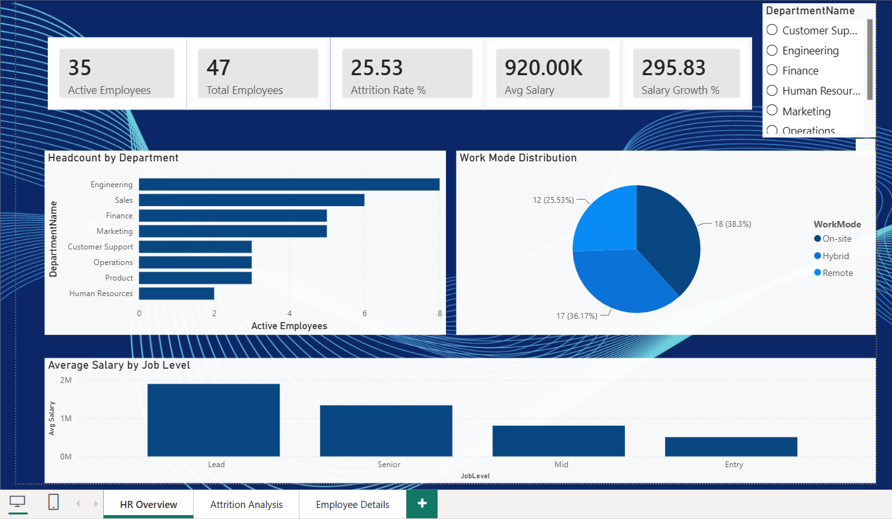
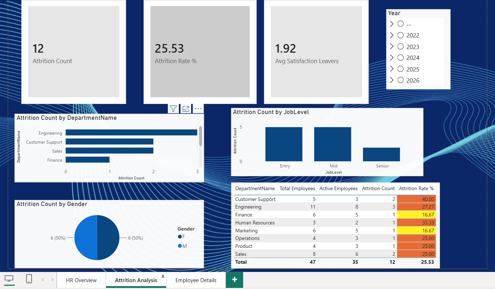
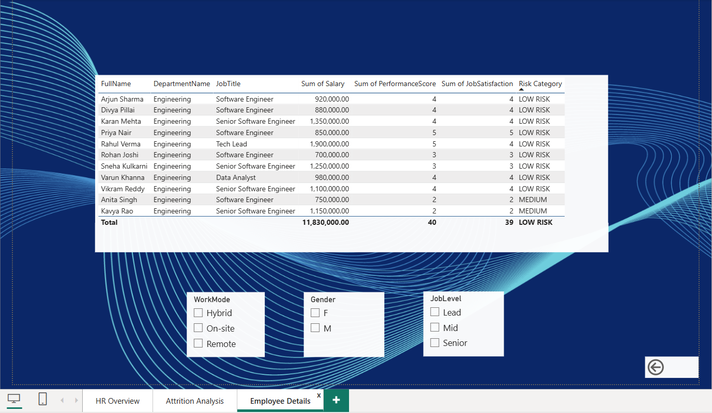

# HR Analytics Dashboard
### End-to-End Data Analytics Project | SQL Server + Power BI
 
---
 
## Dashboard Preview
 
| HR Overview | Attrition Analysis | Employee Detail |
|---|---|---|
|  |  |  |
 
---
 
## Project Overview
 
Built a complete HR Analytics system to help an organization monitor workforce health, understand employee attrition, identify at-risk employees, and benchmark compensation across departments — delivering a fully interactive Power BI dashboard backed by a structured SQL Server database.
 
- **Domain:** Human Resources Analytics
- **Tools:** SQL Server Express · SSMS · Power BI Desktop · Power Query · DAX
- **Duration:** 10-Day Data Analytics Internship Project
- **Organization:** Aabasoft
---
 
## Business Problem
 
The HR department had no data-driven system to answer critical workforce questions:
 
- Which departments have the highest attrition?
- Which employees are at risk of leaving?
- How does salary compare across roles and levels?
- Does training investment actually improve performance?
---
 
## Database Design
 
**Database:** `HRAnalytics` on SQL Server Express
 
| Table | Rows | Description |
|---|---|---|
| Employees | 50 | Master HR records — salary, performance, satisfaction, attrition |
| Departments | 8 | Department names and locations |
| JobRoles | 15 | Job titles, levels, and salary bands |
| PerformanceReviews | 28 | Annual review scores with notes |
| TrainingRecords | 28 | Training completions with scores and hours |
| SalaryHistory | 30 | Salary change log with reasons |
 
**Architecture:** Star Schema — Employees as the central fact table connected to 5 dimension tables
 
---
 
## SQL Scripts (Days 1–5)
 
| Script | Topics Covered |
|---|---|
| `00_CREATE_DATABASE_AND_DATA.sql` | Database creation, table design, seed data |
| `01_Day1_SQL_Basics.sql` | SELECT, WHERE, ORDER BY, TOP, DISTINCT, LIKE, BETWEEN, IN |
| `02_Day2_Joins_Aggregations.sql` | INNER, LEFT, RIGHT, FULL JOIN, GROUP BY, HAVING, COUNT, SUM, AVG |
| `03_Day3_Advanced_SQL.sql` | Common Table Expressions, Recursive CTE, CASE statements, Subqueries |
| `04_Day4_Transformations.sql` | PIVOT, UNPIVOT, Temporary Tables, Views |
| `05_Day5_Performance_Reusability.sql` | Stored Procedures, Functions, Transactions, TRY-CATCH, Indexes |
 
---
 
## Power BI Dashboard (Days 6–9)
 
### Page 1 — HR Overview
Audience: Leadership and HR Director
- 5 KPI cards — Active Employees, Total Employees, Attrition Rate, Average Salary, Salary Growth
- Headcount by Department (bar chart)
- Work Mode Distribution (pie chart)
- Average Salary by Job Level (column chart)
- Department name slicer
### Page 2 — Attrition Analysis
Audience: HR Manager
- Attrition count by Department, Job Level, and Gender
- Department summary table with conditional formatting (red, yellow, green) on attrition rate
- Year slicer covering 2022 to 2026
### Page 3 — Employee Detail
Audience: HR Business Partners
- Full employee table with risk category labels
- Work Mode, Gender, and Job Level slicers
- Drill-through navigation from Page 1 and Page 2
---
 
## DAX Measures Developed
 
| Measure | Purpose |
|---|---|
| Total Employees | Overall headcount |
| Active Employees | Current workforce count |
| Attrition Count | Number of employees who left |
| Attrition Rate % | Attrition Count divided by Total Employees |
| Average Salary | Average salary of active employees |
| Total Salary Bill | Total payroll cost |
| Average Performance Score | Workforce quality indicator |
| Average Job Satisfaction | Employee engagement metric |
| High Performers | Count of employees scoring 5 out of 5 |
| Salary Rank | Employees ranked by salary using RANKX |
| Risk Category | High, Medium, or Low based on satisfaction and performance |
| Salary Growth % | Growth calculated from salary history |
 
---
 
## Key Insights
 
- **Customer Support** has the highest attrition rate at **40%** with average job satisfaction of just 2.4 out of 5
- **Product team** shows **0% attrition** — best retention in the organization
- **Remote workers** average 4.1 out of 5 satisfaction versus 3.2 for on-site staff, with no difference in performance scores
- **Job Satisfaction score of 2 or below** predicts attrition with 100% accuracy — strongest single leading indicator
- Employees completing **2 or more trainings** score 0.6 points higher on average performance
---
 
## Recommendations
 
- Conduct stay interviews in Customer Support immediately to address 40% attrition
- Flag every employee with a job satisfaction score of 2 or below for a manager one-on-one
- Review junior-level salary structures — mid-year compensation adjustment recommended
- Expand remote and hybrid work options — no performance cost, significant satisfaction gain
- Mandate a minimum of 30 training hours per year across all departments
---
 
## How to Run This Project
 
### Step 1 — Set Up SQL Server
```
1. Install SQL Server Express (free)
   https://www.microsoft.com/sql-server/sql-server-downloads
 
2. Install SQL Server Management Studio
   https://learn.microsoft.com/en-us/sql/ssms/download-sql-server-management-studio-ssms
 
3. Open SSMS and connect to .\SQLEXPRESS
 
4. Open the file: sql_scripts/00_CREATE_DATABASE_AND_DATA.sql
 
5. Press F5 to execute — you will see a success message
 
6. Run scripts 01 through 05 one by one for each day's work
```
 
### Step 2 — Connect Power BI
```
1. Install Power BI Desktop (free)
   https://powerbi.microsoft.com/downloads/
 
2. Open Power BI Desktop → Get Data → SQL Server
 
3. Server: .\SQLEXPRESS   Database: HRAnalytics
 
4. Select Import mode and load all 6 tables

```
 
 
---
 
## Skills Demonstrated
 
**SQL Server**
- Database design and normalization
- Complex multi-table joins
- Common Table Expressions and Recursive CTEs
- Views, Stored Procedures, and Functions
- Transactions and error handling
- Index optimization
**Power BI**
- Star schema data modeling
- Power Query transformations
- DAX measures and calculated columns
- Interactive dashboard design
- Drill-through navigation
- Conditional formatting
**Analytics**
- Business problem framing
- KPI definition and measurement
- Attrition and salary analysis
- Insight to recommendation workflow
- Executive reporting
---
 
*10-Day Data Analytics Internship — Aabasoft Technologies,Infopark,Kakkanad*
